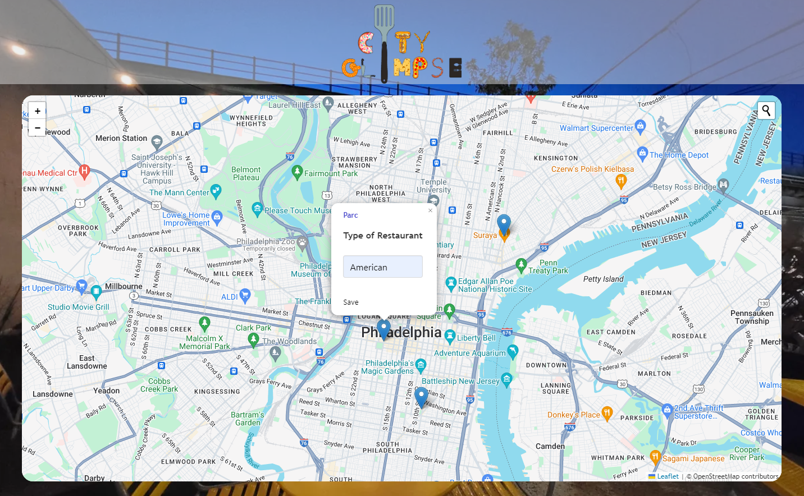

# City Glimpse

## License

This project is licensed under the [MIT License] - see [LICENSE](LICENSE) file for more details.

## Description

Welcome to the City Glimpse, a full-stack web application that empowers users to save and revisit their favorite restaurants on an interactive map. This application is built using a Node.js and Express.js back end, employs the Handlebars.js template engine, and follows the MVC paradigm for a clean and organized folder structure.

## Table of Contents

- [License](#license)
- [Description](#description)
- [Demonstration](#demonstration)
- [Screenshots](#screenshots)
- [Usage](#usage)
- [Technologies](#technologies)
- [Contributors](#contributors)

## Demonstration

[Link to Demonstration video](https://clipchamp.com/watch/ylmHMzLhPQm)

## Screenshots
### Landing

### Login and Signup

### Map with Saved Restaurants

## Usage

### Run application:

1. Once on the landing page, click the "Get started" button to be directed to the login/signup page.
2. Complete one of either the login or signup form and submit. 
3. User will be directed to the main page where they can begin searching restaurants via the search input in the top right corner of the map.
4. The restaurant will be pinned on the map, at which point the user can save the restaurant to their account using the save button in the popup.

## Technologies

## Contributors

Thank you to the following contributors for their valuable contributions to this project:

- **[Savannah Klinger](https://github.com/savannahjk02)** - Front end Development
- **[Tom Dossman](https://github.com/Dossman-thomas)** - Front end Development
- **[Courtney Kalbach](https://github.com/KNC2007)** - Back end Development
- **[Opal Snellenberger](https://github.com/OpalSnellneberger)** - Back end Development

